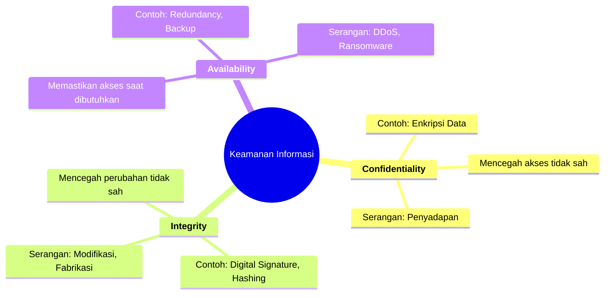

### **Pertemuan 1: Steganografi - Seni Menyembunyikan Pesan**

#### **1. Rangkuman Materi**

*   **Topik Utama:**
    Mempelajari Steganografi, yaitu ilmu dan seni menyembunyikan **keberadaan** sebuah pesan rahasia di dalam media lain yang terlihat normal (seperti gambar, audio, atau teks) agar tidak menimbulkan kecurigaan.

*   **Konsep Penting dan Penjelasannya:**
    *   **Perbedaan Steganografi dan Kriptografi:** Ini adalah konsep fundamental.
        *   **Kriptografi:** Menyembunyikan **isi** (konten) pesan. Pesannya terlihat, tapi dalam bentuk acak (ciphertext) dan tidak bisa dibaca tanpa kunci. Tujuannya adalah kerahasiaan konten. Contoh: `xjT#9uvmY!rc$`. Orang tahu ada pesan rahasia, tapi tidak tahu isinya.
        *   **Steganografi:** Menyembunyikan **keberadaan** (eksistensi) pesan. Pesan rahasia disisipkan ke dalam media lain (cover object) sehingga tidak ada yang sadar ada pesan tersembunyi. Tujuannya adalah menghindari kecurigaan.
    *   **Analog "Prisoner's Problem":**
        *   **Alice & Bob:** Dua orang yang ingin berkomunikasi secara rahasia (dalam penjara).
        *   **Fred (Warden):** Penjaga yang mengawasi semua komunikasi.
        *   **Masalah:** Bagaimana Bob bisa mengirim pesan ke Alice tanpa Fred tahu bahwa mereka sedang bertukar pesan rahasia? Jika Bob mengirim surat terenkripsi, Fred akan curiga. Jika Bob mengirim gambar pemandangan yang di dalamnya ada pesan tersembunyi, Fred mungkin tidak akan curiga sama sekali.

*   **Istilah Teknis Penting:**
    *   **Embedded Message (Hiddentext):** Pesan rahasia yang ingin disembunyikan. Contoh: "SERANG JAM 5 PAGI".
    *   **Cover-Object (Covertext):** Media penampung yang digunakan untuk menyembunyikan pesan. Bisa berupa gambar, audio, video, atau teks biasa. Contoh: Sebuah foto kucing.
    *   **Stego-Object (Stegotext):** **Cover-object** yang sudah berisi **embedded message**. Ini adalah hasil akhir yang dikirimkan. Contoh: Foto kucing yang sudah disisipi pesan rahasia.
    *   **Stego-Key:** Kunci rahasia (opsional) yang digunakan untuk menyisipkan dan mengekstrak pesan, menambah lapisan keamanan.
    *   **Steganalysis:** Ilmu dan seni untuk mendeteksi keberadaan pesan tersembunyi. Ini adalah "lawan" dari steganografi.

*   **Proses Steganografi:**
    `Hiddentext` + `Cover-object` + `Key` → **Encoding (Embedding)** → `Stego-object`
    `Stego-object` + `Key` → **Decoding (Extraction)** → `Hiddentext`

*   **Contoh dan Ilustrasi:**
    1.  **Teks dalam Teks (Acrostic):**
        *   **Hiddentext:** "Lari jam satu"
        *   **Stegotext:** "**L**upakan **a**sal **r**umor **i**tu, **j**aga **a**gar **m**atamu **s**ehat **a**tau **t**urunkan **u**banmu"
        *   **Metode:** Pesan disembunyikan dengan mengambil huruf pertama dari setiap kata.
    2.  **Teks dalam Gambar (LSB - Least Significant Bit):**
        *   **Hiddentext:** "MATIKAN LISTRIK PUKUL 13.00!"
        *   **Cover-object:** Gambar paprika.
        *   **Metode:** Teks rahasia diubah menjadi biner, lalu bit-bit pesan tersebut disisipkan ke dalam bit paling akhir (paling tidak signifikan) dari data warna setiap piksel gambar. Perubahan ini sangat kecil sehingga tidak terdeteksi oleh mata manusia.
    3.  **Gambar dalam Gambar:**
        *   **Hiddentext:** Gambar jet tempur.
        *   **Cover-object:** Gambar pemandangan salju.
        *   **Metode:** Sama seperti LSB, bit-bit dari gambar jet disisipkan ke dalam bit-bit gambar salju.

*   **Catatan Penting & Tips Belajar:**
    *   Pahami perbedaan mendasar: Kriptografi = pesan acak yang jelas terlihat, Steganografi = pesan normal yang tidak dicurigai.
    *   Ingat-ingat 4 istilah utama: **Hiddentext, Cover-object, Stego-object, Stego-key**.
    *   Steganografi yang baik harus memenuhi kriteria **Imperceptibility** (tidak terdeteksi), **Robustness** (tahan terhadap modifikasi seperti kompresi), dan **Fidelity** (kualitas media tidak menurun drastis).

#### **2. Kumpulan Soal Latihan Ujian**

1.  **(Pilihan Ganda)** Tujuan utama dari steganografi adalah...  
    a. Mengubah pesan menjadi format yang tidak bisa dibaca.  
    b. Menyembunyikan isi pesan dari pihak yang tidak berwenang.  
    c. Menyembunyikan keberadaan pesan agar tidak menimbulkan kecurigaan.  
    d. Mengompres pesan agar ukurannya lebih kecil.  

    **Jawaban:** c. Menyembunyikan keberadaan pesan agar tidak menimbulkan kecurigaan.  
    **Pembahasan:** Pilihan (a) dan (b) lebih merujuk pada tujuan kriptografi. Steganografi berfokus pada kerahasiaan *eksistensi* pesan itu sendiri.

2.  **(Isian Singkat)** Dalam terminologi steganografi, sebuah gambar pemandangan yang digunakan untuk menyembunyikan sebuah file teks rahasia disebut sebagai \_\_\_\_\_\_\_\_\_\_.

    **Jawaban:** Cover-object (atau Covertext).
    **Pembahasan:** *Cover-object* adalah media pembawa atau penampung pesan rahasia.

3.  **(Uraian)** Jelaskan perbedaan mendasar antara Kriptografi dan Steganografi menggunakan analogi "mengirim surat".

    **Jawaban:**
    *   **Kriptografi** ibarat menulis surat dengan bahasa sandi atau kode rahasia. Tukang pos (pihak ketiga) tahu kita mengirim surat, bahkan mungkin curiga karena isinya aneh dan tidak bisa dibaca, tapi dia tidak tahu apa arti pesan di dalamnya. Fokusnya adalah melindungi **isi** surat.
    *   **Steganografi** ibarat menulis surat biasa tentang cuaca, tetapi di antara baris-barisnya, kita membuat titik-titik kecil dengan tinta tak terlihat yang membentuk pesan rahasia. Tukang pos melihatnya sebagai surat biasa dan tidak curiga sama sekali. Fokusnya adalah menyembunyikan **fakta** bahwa kita sedang mengirim pesan rahasia.

4.  **(Studi Kasus)** Seorang jurnalis ingin mengirimkan data sensitif berupa dokumen teks kepada editornya melalui email. Untuk menghindari penyadapan oleh pemerintah, ia menyembunyikan file dokumen tersebut di dalam sebuah file lagu MP3.  
    a. Apa yang disebut sebagai *Hiddentext* dalam kasus ini?    
    b. Apa yang disebut sebagai *Cover-object*?    
    c. Apa yang disebut sebagai *Stego-object*?  

    **Jawaban:**  
    a. **Hiddentext:** Dokumen teks berisi data sensitif.  
    b. **Cover-object:** File lagu MP3 asli.  
    c. **Stego-object:** File lagu MP3 yang sudah disisipi dokumen teks.  

5.  **(Praktik)** Anda diberi pesan rahasia **"BAWA UANG"**. Buatlah sebuah pesan *stegotext* sederhana menggunakan metode huruf pertama setiap kata (seperti contoh di slide)!

    **Jawaban:** (Contoh, bisa bervariasi) "**B**esok **a**da **w**awancara **a**nak **u**saha **a**nda, **n**anti **g**ugup."
    **Pembahasan:** Metode ini disebut *acrostic*, di mana huruf pertama dari setiap kata atau baris membentuk pesan tersembunyi.

#### **3. Bonus: Latihan Tambahan (Steganografi & Kriptografi Klasik)**

*   **Latihan Steganografi (Metode Acrostic)**
    1.  **Ekstraksi:** Temukan pesan tersembunyi dari kalimat berikut (metode: huruf kedua setiap kata): "M**a**lam s**e**pi, t**a**k a**d**a s**u**ara."
        *   **Jawaban:** "AEDUS"
    2.  **Penyisipan:** Sembunyikan kata **"AMAN"** menggunakan metode huruf terakhir setiap kata.
        *   **Jawaban (contoh):** "Har**a**p Maklu**m** An**a**k Nakal**n**."

*   **Latihan Kriptografi Klasik (Caesar Cipher)**
    Caesar Cipher adalah teknik enkripsi dengan menggeser setiap huruf sejauh `n` langkah dalam alfabet.
    1.  **Enkripsi:** Enkripsikan pesan **"SERBU"** dengan kunci geser **3** (geser 3 huruf ke kanan: A→D, B→E, dst).
        *   **Jawaban:** S+3=V, E+3=H, R+3=U, B+3=E, U+3=X. Hasil: **"VHUBX"**
    2.  **Dekripsi:** Dekripsikan pesan **"KHOOR"** yang dienkripsi dengan kunci geser **3** (geser 3 huruf ke kiri).
        *   **Jawaban:** K-3=H, H-3=E, O-3=L, O-3=L, R-3=O. Hasil: **"HELLO"**

*   **Latihan Kriptografi Klasik (Vigenere Cipher)**
    Vigenere Cipher menggunakan kata kunci untuk enkripsi. Berikut perhitungannya menggunakan tabel.
    **Soal:** Enkripsikan pesan **"SERANGMALAMINI"** dengan kata kunci **"RAHASIA"**.

    **Proses Perhitungan:**
    *   Pesan (Plaintext): `SERANGMALAMINI`
    *   Kunci (Key): `RAHASIA` (diulang menjadi `RAHASIARAHASIA`)
    *   Rumus: `Ciphertext = (Plaintext + Key) mod 26`

| Plaintext (P) | Nilai P (A=0) | Key (K) | Nilai K (A=0) | Perhitungan `(P+K) mod 26` | Nilai Cipher | Ciphertext (C) |
| :--- | :---: | :---: | :---: | :---: | :---: | :---: |
| S | 18 | R | 17 | (18 + 17) mod 26 = 35 mod 26 | 9 | **J** |
| E | 4  | A | 0  | (4 + 0) mod 26 = 4 mod 26 | 4 | **E** |
| R | 17 | H | 7  | (17 + 7) mod 26 = 24 mod 26 | 24 | **Y** |
| A | 0  | A | 0  | (0 + 0) mod 26 = 0 mod 26 | 0 | **A** |
| N | 13 | S | 18 | (13 + 18) mod 26 = 31 mod 26 | 5 | **F** |
| G | 6  | I | 8  | (6 + 8) mod 26 = 14 mod 26 | 14 | **O** |
| M | 12 | A | 0  | (12 + 0) mod 26 = 12 mod 26 | 12 | **M** |
| A | 0  | R | 17 | (0 + 17) mod 26 = 17 mod 26 | 17 | **R** |
| L | 11 | A | 0  | (11 + 0) mod 26 = 11 mod 26 | 11 | **L** |
| A | 0  | H | 7  | (0 + 7) mod 26 = 7 mod 26 | 7 | **H** |
| M | 12 | A | 0  | (12 + 0) mod 26 = 12 mod 26 | 12 | **M** |
| I | 8  | S | 18 | (8 + 18) mod 26 = 26 mod 26 | 0 | **A** |
| N | 13 | I | 8  | (13 + 8) mod 26 = 21 mod 26 | 21 | **V** |
| I | 8  | A | 0  | (8 + 0) mod 26 = 8 mod 26 | 8 | **I** |

    **Jawaban:** Hasil enkripsinya adalah **`JEYAFOMRLHMAVI`**.

---

### **Pertemuan 2: Dasar-Dasar Keamanan Sistem Informasi**

#### **1. Rangkuman Materi**

*   **Topik Utama:**
    Memahami konsep fundamental keamanan informasi, termasuk apa itu aset digital, ancaman yang ada, dan prinsip dasar yang harus dilindungi (CIA Triad).

*   **Konsep Penting dan Penjelasannya:**
    *   **Informasi sebagai Aset:** Informasi adalah komoditas berharga. Kehilangan atau kebocorannya dapat menyebabkan kerugian finansial, reputasi, atau bahkan hukum.
    *   **Aset dalam Dunia Digital:**
        *   **Hardware:** Perangkat fisik (komputer, server). Bisa diganti.
        *   **Software:** Sistem operasi, aplikasi. Bisa diinstal ulang.
        *   **Data:** Dokumen, foto, database. **Tidak tergantikan** dan merupakan aset paling berharga. Keamanan informasi berfokus melindungi data ini.
    *   **CIA Triad (Kerahasiaan, Integritas, Ketersediaan):** Tiga pilar utama keamanan informasi.
        *   **Confidentiality (Kerahasiaan):** Memastikan bahwa informasi hanya dapat diakses oleh pihak yang berwenang. Mencegah "pencurian" informasi. Analogi: Menjaga isi diary agar tidak dibaca orang lain.
        *   **Integrity (Integritas):** Menjamin bahwa informasi tetap akurat, konsisten, dan tidak diubah oleh pihak yang tidak sah. Mencegah "perusakan" atau "modifikasi" data. Analogi: Memastikan surat dalam amplop bersegel tidak diubah isinya di tengah jalan.
        *   **Availability (Ketersediaan):** Memastikan bahwa informasi dan sistem dapat diakses oleh pengguna yang sah saat dibutuhkan. Mencegah "gangguan" atau "pemblokiran" akses. Analogi: Mesin ATM yang selalu bisa digunakan untuk menarik uang kapan saja.
    *   **Ancaman Keamanan (Menurut Stallings):**
        *   **Interception (Penyadapan):** Pihak tidak berwenang berhasil mendapatkan akses ke informasi. Ini adalah serangan terhadap **Confidentiality**. Contoh: Menyadap percakapan telepon, mencuri data dari jaringan (man-in-the-middle).
        *   **Interruption (Interupsi):** Aset sistem menjadi tidak tersedia atau tidak dapat digunakan. Ini adalah serangan terhadap **Availability**. Contoh: Serangan DDoS yang membuat website down, memotong kabel jaringan.
        *   **Modification (Modifikasi):** Pihak tidak berwenang tidak hanya mengakses tetapi juga mengubah informasi. Ini adalah serangan terhadap **Integrity**. Contoh: Mengubah jumlah saldo di rekening bank, mengganti isi website (defacement).
        *   **Fabrication (Fabrikasi/Pemalsuan):** Pihak tidak berwenang menyisipkan objek atau data palsu ke dalam sistem. Ini adalah serangan terhadap **Integrity** dan **Authenticity**. Contoh: Mengirim email phishing yang seolah-olah dari bank, menambahkan transaksi palsu ke database.

*   **Istilah Teknis Penting:**
    *   **CIA Triad:** Confidentiality, Integrity, Availability.
    *   **Threat (Ancaman):** Potensi bahaya yang dapat mengeksploitasi kerentanan.
    *   **Risk (Risiko):** Kemungkinan ancaman akan terjadi dan dampak yang ditimbulkannya.
    *   **Brainware, Hardware, Software:** Tiga komponen sistem informasi. Kelemahan pada salah satunya (misal, *brainware* = pengguna yang mudah tertipu phishing) menjadi penyebab risiko.

*   **Catatan Penting & Tips Belajar:**
    *   Hafalkan dan pahami CIA Triad. Ini adalah inti dari hampir semua topik keamanan informasi.
    *   Latih diri untuk mengklasifikasikan setiap contoh serangan ke dalam 4 jenis ancaman (Interception, Interruption, etc.) dan hubungkan dengan prinsip CIA yang dilanggar.

#### **2. Kumpulan Soal Latihan Ujian**

1.  **(Pilihan Ganda)** Seorang peretas berhasil masuk ke sistem database universitas dan mengubah nilai seorang mahasiswa dari C menjadi A. Prinsip keamanan informasi manakah yang paling utama dilanggar dalam kasus ini?  
    a. Confidentiality  
    b. Integrity  
    c. Availability  
    d. Authenticity  

    **Jawaban:** b. Integrity  
    **Pembahasan:** Data (nilai) telah diubah secara tidak sah. Integritas data, yaitu keakuratan dan keasliannya, telah dirusak.

2.  **(Isian Singkat)** Serangan *Denial-of-Service* (DoS) yang membuat sebuah website tidak dapat diakses oleh penggunanya merupakan contoh serangan terhadap prinsip \_\_\_\_\_\_\_\_\_\_.

    **Jawaban:** Availability (Ketersediaan).  
    **Pembahasan:** Serangan DoS bertujuan untuk menghabiskan sumber daya server sehingga layanan tidak lagi tersedia bagi pengguna yang sah.

3.  **(Uraian)** Jelaskan tiga komponen dari CIA Triad dan berikan satu contoh serangan nyata untuk masing-masing komponen!

    **Jawaban:**
    *   **Confidentiality (Kerahasiaan):** Prinsip yang memastikan data hanya diakses oleh pihak berwenang. Contoh serangan: **Penyadapan data kartu kredit** saat transaksi online melalui jaringan Wi-Fi publik yang tidak aman.
    *   **Integrity (Integritas):** Prinsip yang memastikan data tetap akurat dan tidak diubah secara ilegal. Contoh serangan: **Penyebaran hoaks atau disinformasi** di media sosial, di mana konten berita asli diubah untuk menipu pembaca.
    *   **Availability (Ketersediaan):** Prinsip yang memastikan sistem dan data tersedia saat dibutuhkan. Contoh serangan: **Serangan Ransomware**, di mana data dienkripsi oleh peretas dan tidak bisa diakses sampai tebusan dibayar.

4.  **(Analisis Kasus)** Sebuah email palsu yang mengaku dari pihak bank meminta Anda untuk mengklik tautan dan memasukkan username serta password internet banking Anda. Tautan tersebut mengarah ke situs web tiruan yang dibuat oleh penyerang. Jenis serangan apakah ini menurut klasifikasi ancaman Stallings?

    **Jawaban:** Fabrication (Fabrikasi/Pemalsuan).  
    **Pembahasan:** Penyerang membuat dan menyisipkan objek palsu (email dan situs web palsu) ke dalam sistem komunikasi untuk menipu korban dan mencuri informasi.

5.  **(Pilihan Ganda)** Dalam konteks aset digital, manakah yang dianggap sebagai aset yang paling berharga dan tidak tergantikan?  
    a. Server dengan spesifikasi terbaru.  
    b. Lisensi sistem operasi Windows asli.  
    c. Data rekam medis pasien di sebuah rumah sakit.  
    d. Aplikasi pengolah kata.  

    **Jawaban:** c. Data rekam medis pasien di sebuah rumah sakit.  
    **Pembahasan:** Hardware bisa dibeli lagi, software bisa diinstal ulang, tetapi data yang unik dan sensitif seperti rekam medis jika hilang atau bocor tidak dapat diciptakan kembali dan dampaknya sangat besar.

#### **3. Bonus Visualisasi**

*   **Tabel Perbandingan Ancaman Keamanan**

| Jenis Ancaman | Deskripsi | Prinsip CIA yang Dilanggar | Contoh |
| :--- | :--- | :--- | :--- |
| **Interception** | Pihak tak sah mendapatkan akses ke informasi | **Confidentiality** | Menyadap email, *sniffing* lalu lintas jaringan. |
| **Interruption** | Aset sistem menjadi tidak tersedia/rusak | **Availability** | Serangan DDoS, memutus kabel server. |
| **Modification**| Pihak tak sah mengubah informasi | **Integrity** | Mengubah saldo rekening, *website defacement*. |
| **Fabrication** | Pihak tak sah menyisipkan objek palsu | **Integrity/Authenticity** | Mengirim email phishing, menyebar *malware*. |

*   **Mindmap CIA Triad (Sintaks Mermaid)**

---

### **Pertemuan 3: Framework Keamanan Informasi (ISO 27001, COBIT, dan NIST)**

#### **1. Rangkuman Materi**

*   **Topik Utama:**
    Mengenal tiga framework utama yang digunakan organisasi untuk mengelola keamanan informasi dan risiko siber secara terstruktur: ISO 27001, COBIT, dan NIST.

*   **Konsep Penting dan Penjelasannya:**
    *   **Mengapa Butuh Framework?** Organisasi memerlukan panduan, praktik terbaik, dan standar yang teruji untuk membangun program keamanan yang efektif, memastikan kepatuhan terhadap regulasi, dan mengelola risiko secara sistematis.
    *   **ISO 27001:**
        *   **Fokus:** **Manajemen Keamanan Informasi**.
        *   **Apa itu:** Standar internasional untuk *Information Security Management System (ISMS)*, yaitu pendekatan sistematis untuk mengelola informasi sensitif perusahaan agar tetap aman.
        *   **Karakteristik:** Berbasis risiko, menggunakan siklus **PDCA (Plan-Do-Check-Act)** untuk perbaikan berkelanjutan, dan **bisa disertifikasi**. Organisasi bisa mendapatkan sertifikat ISO 27001 sebagai bukti kepatuhan.
    *   **COBIT (Control Objectives for Information and Related Technologies):**
        *   **Fokus:** **Tata Kelola dan Manajemen TI (IT Governance)**.
        *   **Apa itu:** Kerangka kerja yang membantu organisasi menciptakan nilai dari TI dengan menjaga keseimbangan antara realisasi manfaat, optimalisasi risiko, dan penggunaan sumber daya.
        *   **Karakteristik:** Fokus pada *audit, kontrol, dan kepatuhan*. Sering digunakan untuk memenuhi regulasi seperti *Sarbanes-Oxley (SOX)*. COBIT bukan standar keamanan murni, tapi mencakup keamanan sebagai bagian dari tata kelola TI secara keseluruhan. Tidak ada sertifikasi resmi untuk organisasi.
    *   **NIST Cybersecurity Framework (CSF):**
        *   **Fokus:** **Manajemen Risiko Keamanan Siber**.
        *   **Apa itu:** Kerangka kerja yang dikembangkan oleh pemerintah AS (National Institute of Standards and Technology) untuk membantu organisasi mengelola dan mengurangi risiko keamanan siber.
        *   **Karakteristik:** Sangat praktis dan mudah dipahami. Terdiri dari 5 fungsi inti: **Identify, Protect, Detect, Respond, Recover**. Bersifat sukarela dan **tidak memiliki sertifikasi resmi**. Tujuannya adalah sebagai panduan untuk perbaikan.

*   **Istilah Teknis Penting:**
    *   **ISMS (Information Security Management System):** Sistem manajemen yang menjadi fokus ISO 27001.
    *   **PDCA (Plan-Do-Check-Act):** Siklus perbaikan berkelanjutan dalam ISO 27001.
    *   **IT Governance:** Tata kelola TI, fokus utama COBIT.
    *   **5 Fungsi NIST:** Identify, Protect, Detect, Respond, Recover.

*   **Catatan Penting & Tips Belajar:**
    *   Pahami "kata kunci" untuk setiap framework:
        *   **ISO 27001** → **ISMS**, **Sertifikasi**, **Manajemen Keamanan**.
        *   **COBIT** → **Tata Kelola (Governance)**, **Audit**, **Kontrol TI**.
        *   **NIST CSF** → **Risiko Siber**, **Praktis**, **Identify/Protect/Detect/Respond/Recover**.
    *   Ketiganya tidak saling bersaing, melainkan bisa saling melengkapi. Organisasi bisa menggunakan NIST untuk operasional siber sehari-hari, COBIT untuk tata kelola TI, dan ISO 27001 untuk mendapatkan sertifikasi formal.

#### **2. Kumpulan Soal Latihan Ujian**

1.  **(Pilihan Ganda)** Sebuah perusahaan multinasional ingin membuktikan kepada klien globalnya bahwa mereka memiliki sistem manajemen keamanan informasi yang kuat dan sesuai dengan standar internasional. Framework manakah yang paling tepat untuk mereka implementasikan agar bisa mendapatkan sertifikasi resmi?  
    a. COBIT 5  
    b. NIST Cybersecurity Framework  
    c. ISO 27001  
    d. ITIL  

    **Jawaban:** c. ISO 27001
    **Pembahasan:** Hanya ISO 27001 dari pilihan di atas yang menawarkan sertifikasi resmi untuk sistem manajemen keamanan informasi (ISMS) yang diakui secara internasional.

2.  **(Isian Singkat)** Lima fungsi inti dalam NIST Cybersecurity Framework adalah Identify, Protect, Detect, \_\_\_\_\_\_\_\_\_\_, dan Recover.

    **Jawaban:** Respond.
    **Pembahasan:** Lima fungsi ini membentuk siklus hidup manajemen insiden siber: mengidentifikasi aset, melindunginya, mendeteksi jika ada serangan, merespons insiden tersebut, dan memulihkan sistem setelahnya.

3.  **(Uraian)** Jelaskan fokus utama dari COBIT dan mengapa framework ini sering digunakan oleh tim audit internal di sebuah perusahaan!

    **Jawaban:** Fokus utama COBIT adalah pada **tata kelola dan manajemen teknologi informasi (IT Governance & Management)**. Tujuannya adalah untuk memastikan bahwa TI selaras dengan tujuan bisnis dan dikelola dengan baik. COBIT sering digunakan oleh tim audit internal karena menyediakan kerangka kerja yang sangat terstruktur dengan *control objectives* (tujuan kontrol) yang jelas. Ini memungkinkan auditor untuk menilai apakah proses TI di perusahaan sudah efektif, efisien, dan patuh terhadap kebijakan serta peraturan yang berlaku (seperti SOX).

4.  **(Studi Kasus)** Sebuah startup teknologi baru ingin membangun program keamanan siber dari nol. Mereka tidak memiliki anggaran besar untuk sertifikasi, tetapi ingin panduan yang praktis dan mudah diikuti untuk melindungi infrastruktur kritis mereka. Framework mana yang paling cocok untuk mereka adopsi sebagai langkah awal? Jelaskan alasanmu!

    **Jawaban:** **NIST Cybersecurity Framework (CSF)**.
    **Alasan:**
    1.  **Praktis dan Fleksibel:** NIST CSF menyediakan panduan yang mudah diimplementasikan dan dapat disesuaikan dengan ukuran dan kompleksitas organisasi, cocok untuk startup.
    2.  **Fokus pada Risiko:** Pendekatannya yang berbasis risiko membantu startup memprioritaskan upaya keamanan pada aset yang paling penting.
    3.  **Tidak Memerlukan Biaya Sertifikasi:** NIST CSF bersifat sukarela dan gratis untuk digunakan, sangat sesuai untuk perusahaan dengan anggaran terbatas.

5.  **(Pilihan Ganda)** Siklus Plan-Do-Check-Act (PDCA) yang digunakan untuk perbaikan berkelanjutan merupakan ciri khas dari framework...  
    a. NIST CSF  
    b. COBIT  
    c. ISO 27001  
    d. Semua jawaban benar  

    **Jawaban:** c. ISO 27001
    **Pembahasan:** Siklus PDCA adalah metodologi inti yang diamanatkan oleh standar ISO 27001 untuk membangun, mengimplementasikan, memelihara, dan terus meningkatkan ISMS.

#### **3. Bonus Visualisasi**

*   **Tabel Perbandingan Framework Keamanan**

| Aspek | ISO 27001 | COBIT | NIST CSF |
| :--- | :--- | :--- | :--- |
| **Fokus Utama** | Manajemen Keamanan Informasi (ISMS) | Tata Kelola & Manajemen TI | Manajemen Risiko Keamanan Siber |
| **Tujuan** | Melindungi aset informasi secara sistematis | Menyelaraskan TI dengan bisnis, audit, kepatuhan | Meningkatkan postur keamanan siber |
| **Sertifikasi** | **Ya**, bisa disertifikasi | Tidak ada | Tidak ada |
| **Pendekatan** | Berbasis risiko dengan siklus PDCA | Berbasis proses dan kontrol | Berbasis fungsi (Identify, Protect, dll.) |
| **Target Pengguna**| Organisasi yang butuh bukti kepatuhan | Manajemen TI, Auditor, Regulator | Semua organisasi (terutama infrastruktur kritis) |
| **Kelebihan** | Standar internasional, sertifikasi kuat | Kuat untuk audit & tata kelola | Praktis, fleksibel, mudah diadopsi |
| **Kekurangan** | Kompleks dan mahal untuk implementasi | Tidak spesifik hanya untuk keamanan | Tidak ada sertifikasi resmi |

