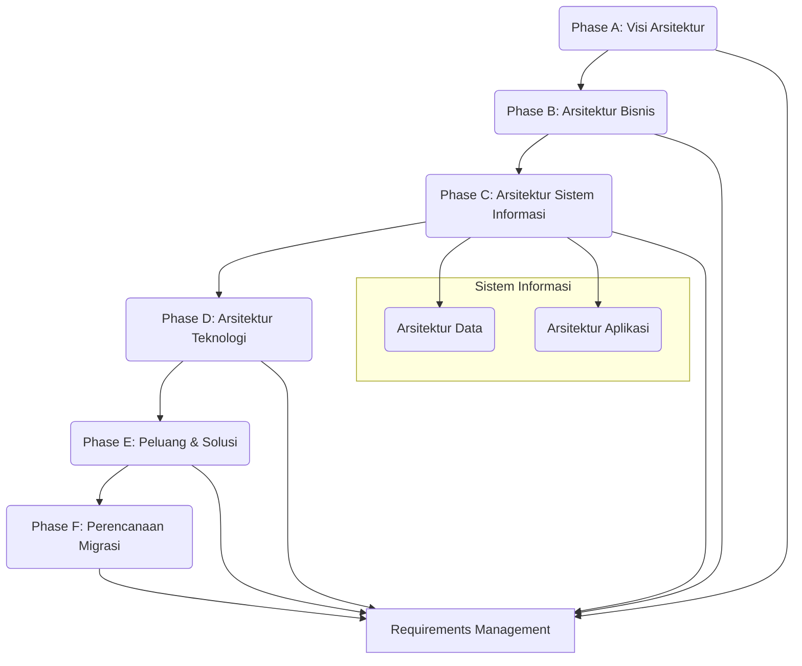

## Panduan Belajar Lengkap: Perencanaan Arsitektur Teknologi Informasi

Berikut adalah rangkuman, soal latihan, dan visualisasi berdasarkan file-file materi yang telah diunggah.

### **Minggu 1: Pengenalan Konsep Arsitektur Enterprise (EA)**

Ini adalah materi pondasi. Memahami ini akan sangat membantu untuk topik-topik selanjutnya.

#### **1. Rangkuman Materi**

*   **Topik Utama:** Memahami "Apa itu Arsitektur Enterprise (EA)?" dan "Mengapa kita membutuhkannya?". Materi ini menjelaskan masalah umum di organisasi yang bisa diselesaikan dengan EA, serta komponen-komponen dasarnya.

*   **Konsep Penting & Penjelasan:**
    *   **Kondisi Umum Organisasi (Masalah):** Tanpa perencanaan yang baik, organisasi sering mengalami:
        *   **Silo Informasi:** Tiap unit kerja punya data dan sistem sendiri, tidak terhubung, dan sering tidak termonitor.
        *   **Inefisiensi Aset:** Ada aset (seperti laptop & printer di contoh) yang menganggur di satu unit, sementara unit lain justru membeli baru.
        *   **Proses Bisnis Rumit & Tak Terkendali:** Sulit untuk melihat gambaran besar bagaimana proses bisnis berjalan.
        *   **Onboarding Lambat:** Pimpinan atau staf baru butuh waktu lama untuk memahami seluk-beluk organisasi.
    *   **Definisi Arsitektur Enterprise (EA):** EA adalah **cetak biru (blueprint)** sebuah organisasi. Ini bukan cuma soal IT, tapi gambaran terpadu yang mencakup **proses bisnis, data, aplikasi, dan infrastruktur teknologi**. Tujuannya adalah menyelaraskan semuanya agar organisasi berjalan lebih efektif dan efisien.
    *   **Rumus Sederhana EA:** `Arsitektur Enterprise = Strategi + Bisnis + Teknologi`. Artinya, teknologi yang kita bangun harus mendukung proses bisnis, dan proses bisnis harus sejalan dengan strategi perusahaan.
    *   **Empat Lapisan (Layer) Utama EA:** Ini adalah inti dari EA. Bayangkan seperti lapisan kue:
        1.  **Arsitektur Bisnis (Paling Atas):** Menjelaskan "APA" yang dilakukan organisasi. Ini mencakup strategi, tujuan, struktur organisasi, dan proses-proses bisnis utama.
        2.  **Arsitektur Data:** Menjelaskan aset data organisasi, baik logis (bagaimana data distrukturkan) maupun fisik (di mana data disimpan), serta cara mengelolanya.
        3.  **Arsitektur Aplikasi:** Berisi daftar aplikasi software yang digunakan, bagaimana mereka berinteraksi satu sama lain, dan bagaimana mereka mendukung proses bisnis di lapisan atas.
        4.  **Arsitektur Teknologi (Paling Bawah):** Fondasinya. Ini adalah semua hardware, software, jaringan, dan infrastruktur IT yang dibutuhkan untuk menjalankan aplikasi, menyimpan data, dan mendukung bisnis.
    *   **Manfaat Menerapkan EA:**
        *   **Efisiensi Proses Bisnis:** Mengurangi biaya operasional dan membuat organisasi lebih lincah (agile) terhadap perubahan.
        *   **Efisiensi Operasional IT:** Mengurangi biaya pengembangan software, meningkatkan interoperabilitas (kemampuan sistem untuk "berbicara" satu sama lain), dan mempermudah upgrade sistem.
        *   **Meningkatkan ROI & Mengurangi Risiko:** Memastikan investasi IT tepat sasaran, mengurangi kompleksitas, dan meminimalisir risiko kegagalan proyek.

*   **Istilah Teknis Penting:**
    *   **Enterprise:** Organisasi atau perusahaan secara keseluruhan.
    *   **Arsitektur:** Struktur fundamental dari komponen-komponen, hubungan antar komponen, dan prinsip yang mengatur desain dan evolusinya.
    *   **Blueprint:** Cetak biru; sebuah rencana atau desain detail.
    *   **Stakeholder:** Pihak-pihak yang berkepentingan (misalnya: manajer, staf IT, pengguna, pelanggan).
    *   **Interoperabilitas:** Kemampuan sistem atau komponen yang berbeda untuk bekerja sama dan bertukar informasi.

*   **Tips Belajar:**
    *   Fokus pada analogi **"EA sebagai Cetak Biru Gedung"**. Arsitek gedung butuh cetak biru untuk memastikan struktur, listrik, dan pipa air terpasang dengan benar. Arsitek Enterprise butuh EA untuk memastikan bisnis, data, dan teknologi "terpasang" dengan benar.
    *   Hafalkan 4 lapisan EA (Business, Data, Application, Technology) dan pahami urutannya dari atas ke bawah. Ini adalah konsep paling fundamental.

---

#### **2. Kumpulan Soal Latihan (Minggu 1)**

**1. [Pilihan Ganda]** Lapisan arsitektur enterprise yang berfokus pada strategi, tata kelola, dan proses inti organisasi adalah...
    a. Arsitektur Teknologi   
    b. Arsitektur Aplikasi   
    c. Arsitektur Bisnis   
    d. Arsitektur Data   
    
  **Jawaban & Pembahasan:** **c. Arsitektur Bisnis.** Lapisan ini adalah yang paling atas dan mendefinisikan "apa" yang dilakukan organisasi, termasuk strategi dan proses bisnisnya.

**2. [Isian Singkat]** Analogi yang paling sering digunakan untuk menggambarkan Arsitektur Enterprise adalah sebagai ______ sebuah organisasi.

  **Jawaban & Pembahasan:** **Cetak biru (blueprint).** Istilah ini menekankan peran EA sebagai panduan desain dan konstruksi terperinci untuk seluruh elemen organisasi.

**3. [Soal Uraian]** Sebuah perusahaan memiliki 5 departemen. Departemen Marketing membeli software CRM baru tanpa berdiskusi dengan Departemen IT. Akibatnya, software tersebut tidak bisa terhubung dengan sistem database penjualan yang sudah ada. Jelaskan bagaimana penerapan Arsitektur Enterprise bisa mencegah masalah ini!

  **Jawaban & Pembahasan:** Penerapan Arsitektur Enterprise (EA) bisa mencegah masalah ini melalui beberapa cara:
    *   **Arsitektur Aplikasi:** EA akan memiliki daftar aplikasi yang sudah disetujui dan peta interaksi antar aplikasi. Sebelum membeli software baru, Departemen Marketing harus merujuk pada arsitektur ini untuk memastikan kompatibilitas.
    *   **Arsitektur Data:** EA mendefinisikan standar data dan bagaimana data dibagikan. Ini akan memastikan software baru bisa mengakses data penjualan dengan benar.
    *   **Tata Kelola (Governance):** EA menetapkan aturan dan proses untuk pengadaan teknologi baru, yang mengharuskan adanya persetujuan dari tim arsitektur atau IT untuk memastikan keselarasan dengan strategi perusahaan.

**4. [Pilihan Ganda]** Manakah di bawah ini yang BUKAN merupakan keuntungan langsung dari penerapan Enterprise Architecture?
    a. Mengurangi biaya operasional IT.   
    b. Meningkatkan penjualan produk secara langsung.   
    c. Membuat organisasi lebih lincah dalam merespon perubahan pasar.   
    d. Meningkatkan interoperabilitas antar sistem.   

  **Jawaban & Pembahasan:** **b. Meningkatkan penjualan produk secara langsung.** EA tidak secara langsung meningkatkan penjualan. EA meningkatkan efisiensi dan efektivitas proses bisnis dan IT, yang *secara tidak langsung* dapat berkontribusi pada layanan pelanggan yang lebih baik dan akhirnya meningkatkan penjualan. Keuntungan lainnya adalah manfaat langsung dari EA.

**5. [Soal Uraian Singkat]** Sebutkan dan jelaskan secara singkat 4 lapisan utama dalam Enterprise Architecture!

  **Jawaban & Pembahasan:**
    1.  **Arsitektur Bisnis:** Menentukan strategi dan proses bisnis organisasi.
    2.  **Arsitektur Data:** Mengelola aset data, baik struktur logis maupun penyimpanan fisiknya.
    3.  **Arsitektur Aplikasi:** Mendefinisikan portofolio aplikasi software dan interaksinya.
    4.  **Arsitektur Teknologi:** Menyediakan fondasi infrastruktur hardware dan jaringan untuk menjalankan semuanya.

---

### **Minggu 2: Tools dan Notasi Pemodelan EA**

Setelah paham konsepnya, sekarang kita belajar cara "menggambar" atau memodelkan arsitektur tersebut.

#### **1. Rangkuman Materi**

*   **Topik Utama:** Mengenal berbagai alat (tools) dan bahasa/notasi visual untuk memodelkan proses bisnis, data, dan sistem dalam kerangka EA.

*   **Konsep Penting & Penjelasan:**
    *   **Tujuan EA Tools:** Membantu arsitek untuk menyelaraskan tujuan bisnis dengan IT, membuat model visual, dan menangkap keterkaitan antar elemen (orang, proses, aplikasi, teknologi).
    *   **Notasi Pemodelan:** Ini adalah "bahasa gambar" standar agar semua orang punya pemahaman yang sama.
        1.  **BPMN (Business Process Modelling Notation):**
            *   **Fokus:** Memodelkan **alur proses bisnis**.
            *   **Kapan digunakan:** Saat kamu ingin menggambarkan langkah-langkah dalam suatu proses, misalnya "Proses Pendaftaran Mahasiswa Baru" atau "Proses Pemesanan Barang".
            *   **Elemen Kunci:** *Events* (lingkaran: awal, akhir), *Activities* (persegi panjang: tugas yang dilakukan), *Gateways* (wajik: titik keputusan/cabang).
        2.  **ERD (Entity Relationship Diagram):**
            *   **Fokus:** Memodelkan **struktur data dan hubungannya**.
            *   **Kapan digunakan:** Saat merancang database. Kamu ingin tahu entitas apa saja yang ada (misal: Mahasiswa, Dosen, Matakuliah) dan bagaimana mereka terhubung (misal: satu Dosen 'mengajar' banyak Matakuliah).
            *   **Elemen Kunci:** *Entities* (persegi panjang: objek/benda), *Attributes* (elips: properti entitas), *Relationships* (wajik: hubungan antar entitas).
        3.  **UML (Unified Modelling Language):**
            *   **Fokus:** Bahasa pemodelan yang sangat luas untuk **rekayasa perangkat lunak (software)**.
            *   **Kapan digunakan:** Saat merancang sebuah sistem software. UML punya banyak jenis diagram, yang paling umum adalah *Use Case Diagram* (interaksi pengguna dengan sistem) dan *Activity Diagram* (mirip BPMN tapi lebih fokus ke alur dalam sistem/software).
            *   **Perbedaan dengan BPMN:** BPMN fokus ke proses bisnis (bisa melibatkan manusia dan sistem), sementara Activity Diagram UML lebih fokus pada alur kerja di dalam satu sistem software.
        4.  **ArchiMate:**
            *   **Fokus:** Bahasa pemodelan yang dirancang **khusus untuk Enterprise Architecture**.
            *   **Kelebihan Utama:** ArchiMate mampu menghubungkan semua lapisan EA (Bisnis, Aplikasi, Teknologi) dalam satu pandangan yang terintegrasi. Ini adalah "lem perekat" antar notasi lain.
            *   **Kapan digunakan:** Saat kamu ingin menunjukkan bagaimana sebuah 'Proses Bisnis' (lapisan bisnis) didukung oleh sebuah 'Aplikasi' (lapisan aplikasi) yang berjalan di atas sebuah 'Server' (lapisan teknologi).

*   **Istilah Teknis Penting:**
    *   **Notasi:** Seperangkat simbol grafis standar untuk merepresentasikan sesuatu.
    *   **Gateway (BPMN):** Titik percabangan dalam proses, misalnya "Jika dokumen disetujui, lanjut. Jika tidak, kembali."
    *   **Entity (ERD):** Objek di dunia nyata yang datanya ingin kita simpan (contoh: Pelanggan, Produk).
    *   **Use Case (UML):** Sebuah fungsionalitas sistem dari sudut pandang pengguna (contoh: "Login ke Sistem", "Melihat Jadwal").

*   **Tips Belajar:**
    *   Jangan mencoba menghafal semua simbol. Fokus pada **tujuan utama** setiap notasi: BPMN untuk proses, ERD untuk data, UML untuk software, dan ArchiMate untuk menyatukan semuanya.
    *   Lihat contoh diagram di slide dan coba "baca" alurnya. Misalnya pada diagram BPMN pemesanan, ikuti panah dari awal "Order received" sampai akhir.

#### **2. Kumpulan Soal Latihan (Minggu 2)**

**1. [Pilihan Ganda]** Seorang analis bisnis ingin memetakan alur kerja persetujuan cuti karyawan yang melibatkan staf, manajer, dan departemen HR. Notasi pemodelan yang paling tepat untuk digunakan adalah...
    a. Entity Relationship Diagram (ERD)   
    b. Use Case Diagram (UML)   
    c. Business Process Modelling Notation (BPMN)   
    d. ArchiMate Layered View   

  **Jawaban & Pembahasan:** **c. Business Process Modelling Notation (BPMN).** BPMN dirancang khusus untuk memodelkan alur proses bisnis yang melibatkan berbagai aktor (orang/departemen) dan langkah-langkah kerja.

**2. [Isian Singkat]** Dalam ERD, simbol persegi panjang digunakan untuk merepresentasikan ______, sementara elips digunakan untuk merepresentasikan ______.

  **Jawaban & Pembahasan:** **Entitas (Entity), Atribut (Attribute).** Entitas adalah objek utama (misal: Mobil), dan Atribut adalah propertinya (misal: Warna, Tahun Produksi).

**3. [Soal Uraian]** Jelaskan perbedaan fundamental antara UML dan ArchiMate dalam konteks pemodelan arsitektur enterprise. Mengapa ArchiMate sering dianggap lebih cocok untuk EA?

  **Jawaban & Pembahasan:**
    *   **UML (Unified Modelling Language)** adalah bahasa pemodelan yang sangat detail dan berfokus pada desain dan pengembangan *perangkat lunak*. UML sangat baik untuk menjelaskan cara kerja internal sebuah aplikasi.
    *   **ArchiMate** adalah bahasa pemodelan tingkat tinggi yang dirancang khusus untuk *Arsitektur Enterprise*. Fokusnya bukan pada detail internal aplikasi, melainkan pada **hubungan antara domain bisnis, aplikasi, dan teknologi**.
    *   ArchiMate lebih cocok untuk EA karena ia menyediakan "bahasa pemersatu" untuk menggambarkan bagaimana layanan bisnis didukung oleh komponen aplikasi, yang kemudian berjalan di atas infrastruktur teknologi. Ia mampu menunjukkan gambaran besar yang terintegrasi, sesuatu yang sulit dilakukan hanya dengan UML.

**4. [Pilihan Ganda]** Anda sedang merancang sebuah database untuk sistem akademik. Anda perlu menentukan tabel-tabel apa saja yang dibutuhkan (misalnya Mahasiswa, Dosen, Kelas) dan bagaimana relasi antar tabel tersebut. Notasi yang Anda gunakan adalah...   
    a. BPMN   
    b. ERD   
    c. Sequence Diagram   
    d. State Diagram   

  **Jawaban & Pembahasan:** **b. ERD (Entity Relationship Diagram).** ERD adalah standar industri untuk merancang model data dan skema database, yang secara visual merepresentasikan entitas (tabel) dan relasinya.

**5. [Soal Uraian Singkat]** Apa tujuan utama dari penggunaan EA Tools seperti BiZZdesign atau Archi?

  **Jawaban & Pembahasan:** Tujuan utamanya adalah untuk membantu organisasi **menyelaraskan tujuan bisnis dengan infrastruktur TI** dengan cara (1) membuat dan menerapkan model visual untuk proses bisnis dan arsitektur TI, serta (2) menangkap dan menganalisis keterkaitan antar berbagai elemen dalam ekosistem perusahaan (orang, proses, data, teknologi).

---

### **Minggu 3: Kerangka Kerja TOGAF**

Setelah paham konsep dan cara menggambarnya, sekarang kita belajar salah satu "metode" atau "resep" paling populer untuk membuat EA, yaitu TOGAF.

#### **1. Rangkuman Materi**

*   **Topik Utama:** Memahami TOGAF (The Open Group Architecture Framework) sebagai sebuah metode standar untuk mengembangkan dan mengelola Arsitektur Enterprise.

*   **Konsep Penting & Penjelasan:**
    *   **Apa itu TOGAF?** TOGAF adalah sebuah **kerangka kerja (framework)** dan **metode** yang memberikan panduan langkah-demi-langkah (resep) untuk membuat arsitektur enterprise. Ini adalah standar terbuka yang paling banyak digunakan di dunia.
    *   **ADM (Architecture Development Method):** Ini adalah **jantungnya TOGAF**. ADM adalah sebuah siklus iteratif yang terdiri dari beberapa fase untuk mengembangkan arsitektur. Kamu tidak perlu hafal semua, tapi pahami fase-fase utamanya:
        *   **Preliminary Phase:** Persiapan. Menentukan lingkup, tim, dan framework yang akan disesuaikan.
        *   **Phase A: Architecture Vision:** Menetapkan visi, tujuan, dan batasan proyek arsitektur. Mendapatkan persetujuan dari manajemen.
        *   **Phase B: Business Architecture:** Menganalisis dan mendokumentasikan arsitektur bisnis saat ini (as-is) dan yang diinginkan (to-be).
        *   **Phase C: Information Systems Architectures:** Menganalisis arsitektur data dan aplikasi (as-is dan to-be).
        *   **Phase D: Technology Architecture:** Menganalisis arsitektur teknologi (infrastruktur) (as-is dan to-be).
        *   **Phase E, F, G, H:** Fase untuk perencanaan migrasi, implementasi, dan pengelolaan perubahan.
        *   **Requirements Management (di tengah):** Kebutuhan bisnis selalu dipantau di setiap fase.
    *   **Domain Arsitektur TOGAF:** TOGAF membagi arsitektur menjadi 4 domain utama, yang sama persis dengan konsep dasar EA yang kita pelajari di Minggu 1: **Bisnis, Data, Aplikasi, dan Teknologi**. Fase B, C, dan D pada ADM secara langsung memetakan ke domain-domain ini.
    *   **Stakeholder & Governance:** TOGAF sangat menekankan pentingnya:
        *   **Manajemen Stakeholder:** Mengidentifikasi siapa saja yang berkepentingan dan mengelola ekspektasi mereka. Tanpa dukungan stakeholder, proyek EA akan gagal.
        *   **Tata Kelola (Governance):** Membuat aturan, proses, dan struktur (seperti "Dewan Arsitektur") untuk memastikan bahwa implementasi proyek sesuai dengan arsitektur yang telah disepakati.
    *   **Prinsip Arsitektur:** Aturan tingkat tinggi yang menjadi panduan dalam mengambil keputusan. Contoh: "Data harus dapat diakses bersama", "Gunakan platform teknologi yang terbuka", "Prioritaskan kemudahan penggunaan". Prinsip ini harus stabil dan dipahami semua stakeholder.

*   **Istilah Teknis Penting:**
    *   **Framework:** Kerangka kerja; seperangkat konsep, praktik, dan kriteria untuk menyelesaikan suatu masalah.
    *   **ADM (Architecture Development Method):** Metode inti dari TOGAF, berupa siklus pengembangan arsitektur.
    *   **Repository:** Tempat penyimpanan semua artefak arsitektur (diagram, dokumen, model, dll).
    *   **Gap Analysis:** Analisis kesenjangan antara kondisi saat ini (as-is) dan kondisi yang diinginkan (to-be).

*   **Tips Belajar:**
    *   Fokus pada **ADM (Architecture Development Method)**. Pahami bahwa ini adalah siklus yang dimulai dari visi, lalu menganalisis bisnis, sistem informasi (data & aplikasi), dan teknologi.
    *   Hubungkan konsep TOGAF dengan materi minggu pertama. Lihat bagaimana TOGAF menyediakan *metode* untuk membangun 4 lapisan arsitektur (Bisnis, Data, Aplikasi, Teknologi) yang sudah kamu pelajari.

#### **2. Kumpulan Soal Latihan (Minggu 3)**

**1. [Pilihan Ganda]** Proses inti yang menjadi jantung dari kerangka kerja TOGAF dan menyediakan siklus langkah-demi-langkah untuk mengembangkan arsitektur disebut...   
    a. Enterprise Continuum   
    b. Architecture Development Method (ADM)   
    c. Architecture Content Framework   
    d. Architecture Capability Framework   

  **Jawaban & Pembahasan:** **b. Architecture Development Method (ADM).** ADM adalah siklus iteratif yang menjadi metode utama dalam TOGAF untuk merancang, mengembangkan, dan mengelola EA.   

**2. [Soal Uraian]** Dalam siklus TOGAF ADM, fase apakah yang berfokus pada analisis proses bisnis, strategi, dan struktur organisasi? Jelaskan secara singkat tujuan dari fase tersebut.   

  **Jawaban & Pembahasan:** **Fase B: Business Architecture.** Tujuannya adalah untuk mengembangkan arsitektur bisnis target (to-be) yang sejalan dengan visi arsitektur (dari Fase A). Fase ini melibatkan pemodelan proses bisnis, fungsi organisasi, dan informasi yang dibutuhkan untuk mendukung strategi perusahaan.   

**3. [Isian Singkat]** TOGAF membagi arsitektur ke dalam empat domain utama, yaitu Bisnis, ______, Aplikasi, dan Teknologi.   

  **Jawaban & Pembahasan:** **Data.** Keempat domain ini (Business, Data, Application, Technology) adalah pilar utama dalam pemodelan arsitektur menurut TOGAF.   

**4. [Pilihan Ganda]** "Semua data harus dimiliki oleh satu unit bisnis yang jelas" dan "Sistem baru harus menggunakan standar otentikasi terpusat" adalah contoh dari...   
    a. Visi Arsitektur   
    b. Prinsip Arsitektur   
    c. Kebutuhan (Requirement)   
    d. Hasil Gap Analysis   

  **Jawaban & Pembahasan:** **b. Prinsip Arsitektur.** Prinsip arsitektur adalah aturan atau pedoman tingkat tinggi, bersifat stabil, dan digunakan untuk mengarahkan pengambilan keputusan desain di seluruh organisasi.

**5. [Soal Uraian]** Mengapa manajemen stakeholder sangat penting dalam implementasi arsitektur enterprise menggunakan TOGAF? Berikan contoh potensi masalah jika stakeholder diabaikan.   

  Jawaban & Pembahasan:** Manajemen stakeholder penting karena proyek EA berdampak pada banyak bagian organisasi. Dukungan dan masukan dari mereka sangat krusial untuk kesuksesan. Jika stakeholder diabaikan, bisa terjadi masalah seperti:
    *   **Penolakan Perubahan:** Departemen menolak mengadopsi sistem atau proses baru karena mereka tidak merasa dilibatkan dalam proses pengambilan keputusan.
    *   **Kebutuhan Tidak Terpenuhi:** Arsitektur yang dirancang tidak sesuai dengan kebutuhan bisnis nyata karena tim arsitek tidak mendapatkan masukan yang cukup dari pengguna akhir.
    *   **Kurangnya Anggaran/Dukungan:** Proyek bisa berhenti di tengah jalan karena pimpinan atau manajer kunci tidak memahami manfaatnya dan menarik dukungan mereka.

***

### **3. Bonus Visualisasi**

#### **Tabel Perbandingan Notasi Pemodelan**

| Notasi | Tujuan Utama | Kapan Digunakan? | Elemen Kunci |
| :--- | :--- | :--- | :--- |
| **BPMN** | Memodelkan alur **Proses Bisnis** | Ingin menggambarkan langkah-langkah kerja dari awal sampai akhir (misal: alur peminjaman buku). | Events, Activities, Gateways |
| **ERD** | Memodelkan struktur **Data** | Saat merancang skema database (misal: tabel apa saja yang dibutuhkan untuk Siakad). | Entities, Attributes, Relationships |
| **UML** | Merancang sistem **Perangkat Lunak** | Saat mendesain aplikasi (misal: apa saja fitur yang bisa dilakukan user/Use Case). | Actors, Use Cases, Classes, Objects |
| **ArchiMate** | Mengintegrasikan **Semua Lapisan EA** | Ingin menunjukkan hubungan antara bisnis, aplikasi, dan teknologi (misal: Proses 'Pendaftaran' didukung 'Aplikasi SIAKAD' yang berjalan di 'Server Kampus'). | Business Layer, Application Layer, Technology Layer Elements |

#### **Diagram Alur Sederhana Siklus TOGAF ADM**

**Penjelasan Diagram:**
*   Diagram ini menunjukkan alur inti dari TOGAF ADM, dari Visi hingga Perencanaan.
*   Fase C dipecah menjadi Arsitektur Data dan Aplikasi.
*   "Requirements Management" berada di tengah, menunjukkan bahwa pengelolaan kebutuhan terjadi secara terus-menerus di semua fase.
